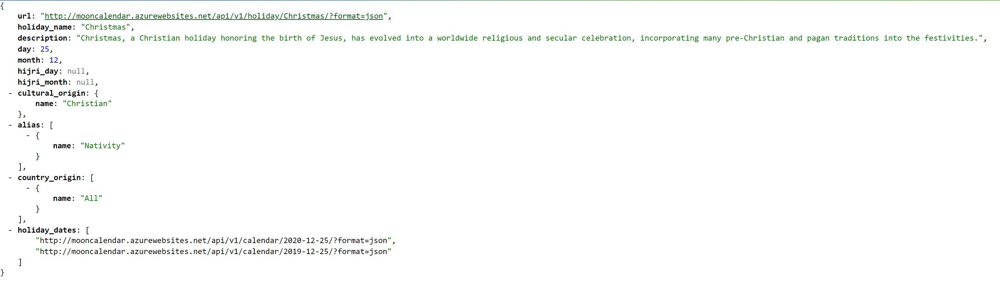
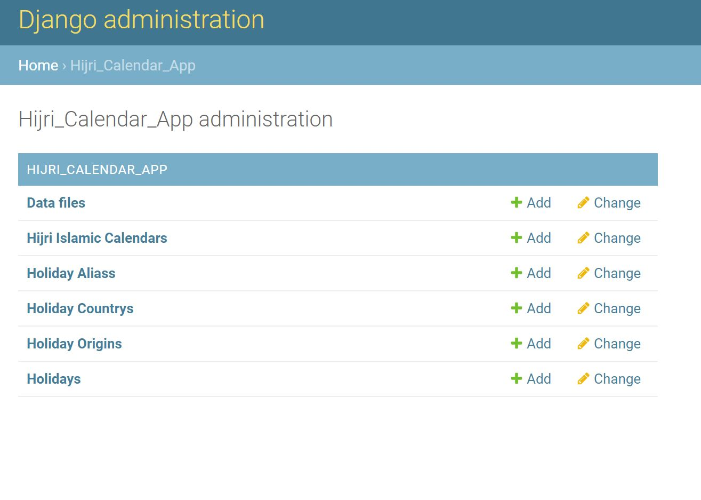
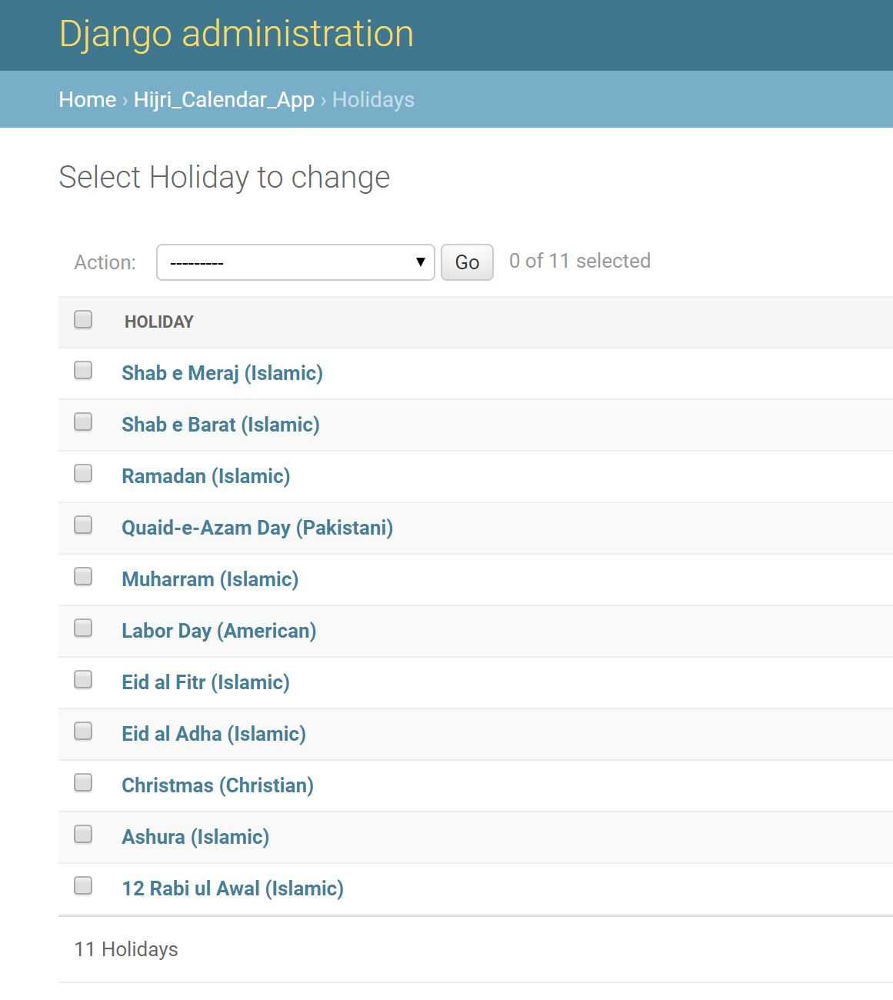
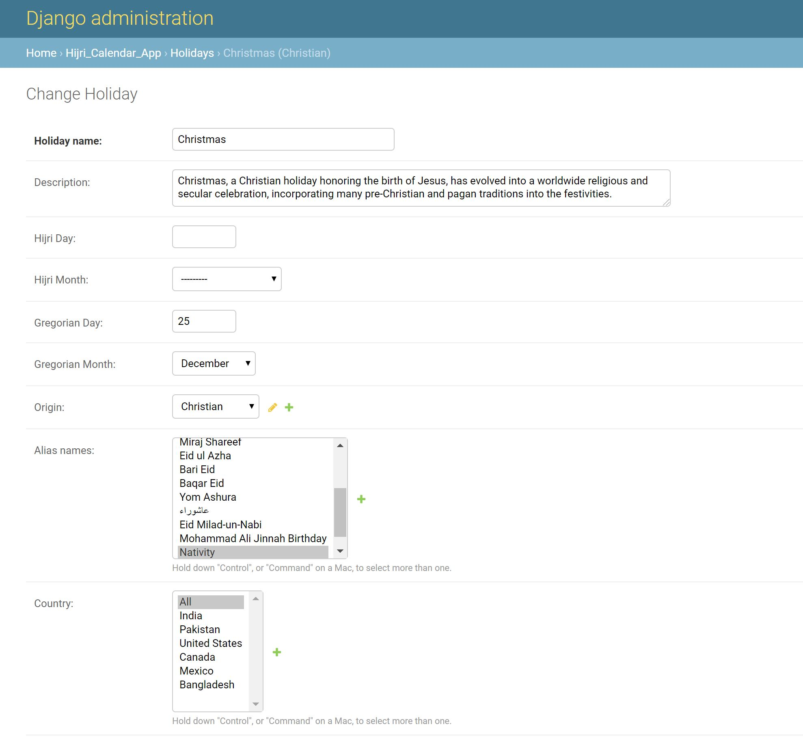
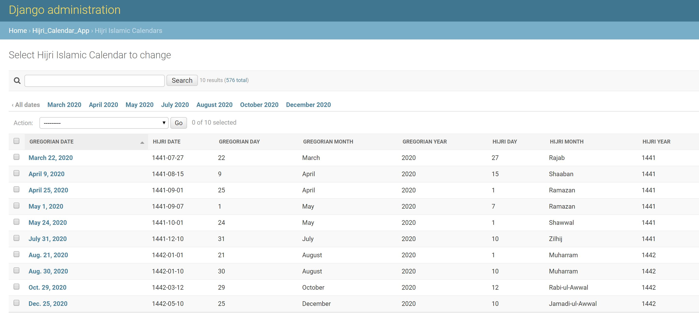
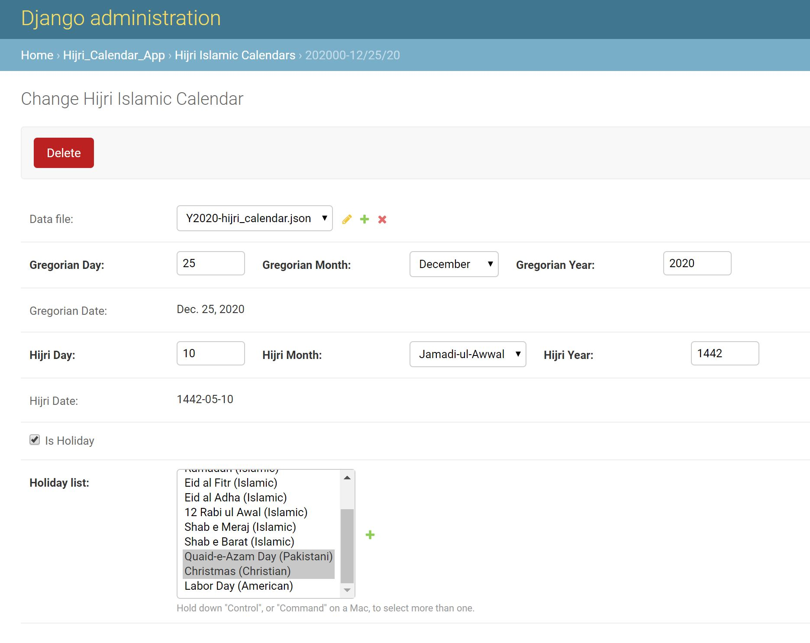

# Restful API for Pakistani Holidays

This repo is created to display hijri calendar and Pakistani holidays via restful API.
Data is obtained from official [pakmoonsighting.com.pk] government website.

----
[](https://travis-ci.org/bilgrami/hijri-calendar)

----

## Demo Links

* [Pak Holidays Website] - Mooncalendar website is hosted on Azure Cloud Platform
* [Holidays API] - The Holiday API provides access to public holidays observed in Pakistan. API is public and require no authenticatation for read-only access.
* [Calendar API] - The Calendar API provides access to two years (Y2019 and Y2020) worth of hijri calendar data. API is public and require no authenticatation for read-only access.

----

## Source data

Source data for calendar dates is stored in CSV. For other models (like holiday etc.), data is stored as JSON so that it can be imported as Django fixtures via loaddata command.

Folder locations:

1) Calendar dates as CSV files - [link](https://github.com/bilgrami/hijri-calendar/tree/master/project/hijri_calendar_project/hijri_calendar_app/data/source "")
2) Model fixtures as json - [link](https://github.com/bilgrami/hijri-calendar/tree/master/project/hijri_calendar_project/hijri_calendar_app/fixtures)

CSV files are stored under "project/hijri_calendar_project/hijri_calendar_app/data/source" folder by year. For example "Y2019-hijri_calendar.csv".
Columns in CSV files are as follows:

| pk | LunarDay | LunarMonth | LunarMonthName | LunarYear | Day | monthName | month | Year | dataFile | hijri_date_value | hijri_date_value |
| ------ | ------ | ------ | ------ | ------ | ------ | ------ | ------ | ------ | ------ | ------ | ------ |
| 2019-06-05|1|10|Shawwal|1440|5|June|6|2019|Y2019-hijri_calendar.json|1440-10-01|1440-10-01 |
| 2019-06-06|2|10|Shawwal|1440|6|June|6|2019|Y2019-hijri_calendar.json|1440-10-02|1440-10-02 |
| 2019-06-07|3|10|Shawwal|1440|7|June|6|2019|Y2019-hijri_calendar.json|1440-10-03|1440-10-03 |

### Importing new calendar dates via CSV

If you want to import calendar data via CSV files, follow these steps to create a JSON fixture file and then import it into the database.

1) place CSV file under "project/hijri_calendar_project/hijri_calendar_app/data/source" folder.
2) Run following management command inside Django shell

```sh
python manage.py get_hijri_json_from_csv \
'../data/source/Y2020-hijri_calendar.csv' > \
./hijri_calendar_app/fixtures/hijri_calendar_Y2020.json;

python manage.py loaddata hijri_calendar_Y2020;

```

----

## Installation

### 1) Pre-requisites

You need docker and docker-compose to run the website.

#### Method 1: Pull image from docker hub

```sh
docker pull -t bilgrami/hijricalendar:latest
```

#### Method 2: Build image on your local machine

```sh
git clone https://github.com/bilgrami/hijri-calendar.git
cd hijri-calendar

## setup python environment
./shell_scripts/setup-environment.sh

docker build -t bilgrami/hijricalendar:latest .
```

### 2) Run Docker Container

After building docker image, launch the website using any of the following methods:

#### Method 1: Use docker with sqllite database

```sh
docker run --rm -it -p 5000:5000/tcp bilgrami/hijricalendar:latest
```

#### Method 2: Use docker-compose with postgrs database

```sh
docker-compose up
```

### 3) Launch Website

Verify the deployment by navigating to your server address in your preferred browser.

```sh
127.0.0.1:5000
```

### Hosting on Azure web app

* Use "docker-compose-sqlite-db.yml" YAML to run the container on Azure with sqllite Db
* Use "docker-compose-azure.yml" YAML to run the container on Azure with postgres Db

----

## Initializing/Seeding Data

First connect with the running web container

```sh
docker-compose exec web bash
```

Once connected, run below shell commands

```sh
cd /usr/local/project/hijri_calendar_project
chmod +x ./shell_scripts/init_script.sh
./shell_scripts/init_script.sh
```

"init_script.sh" script, does the following

1) Runs necessary migrations to setup database tables and relations
2) Loads data using fixtures.
3) Mark calendar dates based on holidays defined in Holiday model

----

## Maintenance Items

### Marking Calendar dates based on Holidays

If you make any change to the holiday model via Admin interface, calendar dates are not automatically updated. For example, if you add a new holiday for Irish St. Patrick's day (March 17), each occurance of March 17th in the calendar needs to be manually updated via the admin interface.

Alternatively, you can run below Django custom command to update all dates with holidays.

First connect with the running web container (see above), and then run the following managment command inside Django shell

```sh
cd /usr/local/project/hijri_calendar_project
python manage.py populate_holidays
```

----

## Screenshots

### 1) Website

#### a) List of Holidays

[List of Holidays]
> 

#### b) Holiday API

[Holiday API]
> 

### 2) Admin Screens

#### a) Admin - App Models - List

> 

#### b) Admin - Holiday - List View

> 

#### c) Admin - Holiday - Detail View

> 

#### d) Admin - Calendar Date - List View

> 

#### e) Admin - Calendar Date - Detail View

> 

----

## Todo/Remaining items

Below is the list (ordered by priority)

1) Add test coverage and integrate with [Travis ci](https://travis-ci.org "Travis CI").
2) Automatically update calendar dates based on change in Holiday model
3) Hosting on other cloud providers such as Google, AWS and Heroku
4) Scrape data directly from official [pakmoonsighting.com.pk] government website.
5) Use redis caching to speed up response time
6) Provide feedback form and guest book

## Future Roadmap

1) Populate more holidays from different countries
2) Create greeting cards for different holidays
3) Create personalized user forms so a user can login and populate personalized holidays and events

----

[Pak Holidays Website]: <https://mooncalendar.azurewebsites.net>
[pakmoonSighting.com.pk]: <http://pakmoonsighting.pk>
[Holidays API]: <https://mooncalendar.azurewebsites.net/api/v1/holiday/>
[Calendar API]: <https://mooncalendar.azurewebsites.net/api/v1/calendar/>
[List of Holidays]: <https://mooncalendar.azurewebsites.net/holiday/>
[Holiday API]: <http://mooncalendar.azurewebsites.net/api/v1/holiday/Christmas/?format=json>
